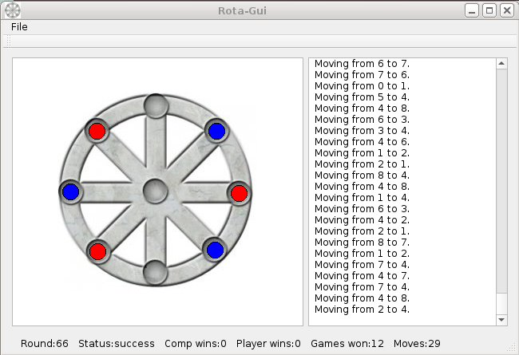

# rota-gui
My solution to the Praetorian Rota Challenge

https://www.praetorian.com/challenges/rota



### build and run

```bash
sudo apt install qt5-default build-essential
cd rota-gui/src
qmake Rota-Gui.pro
make
./Rota-Gui
```
